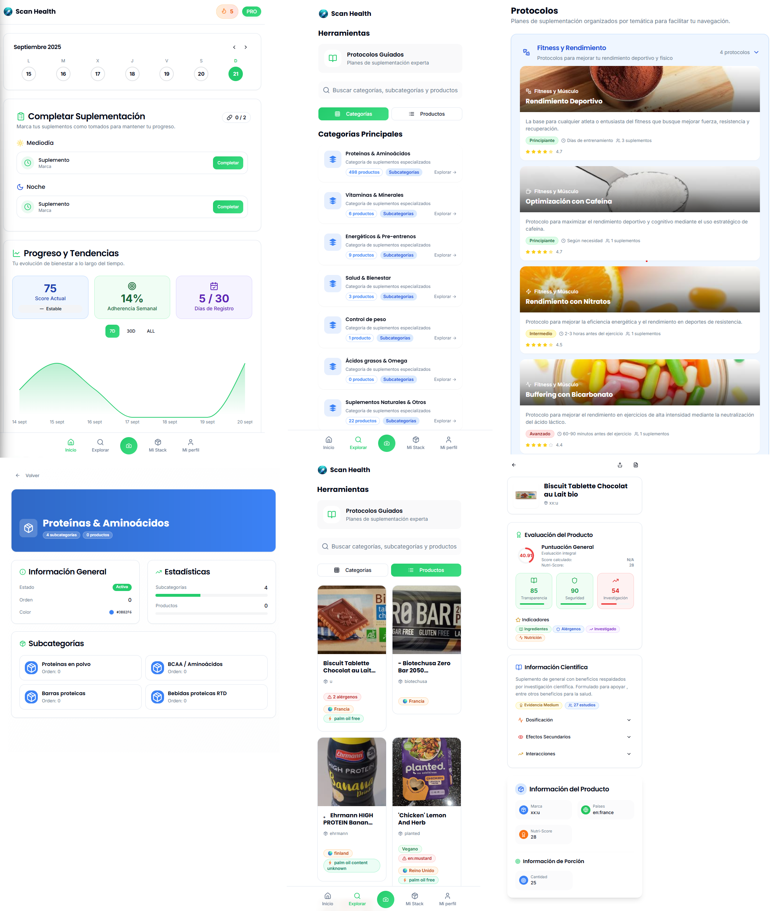
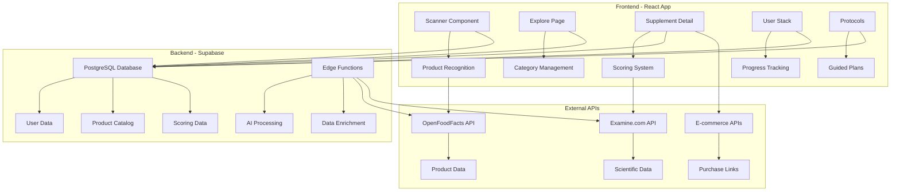
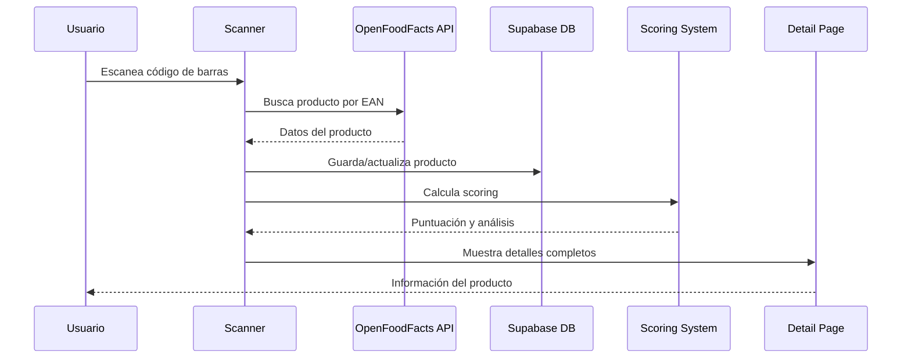
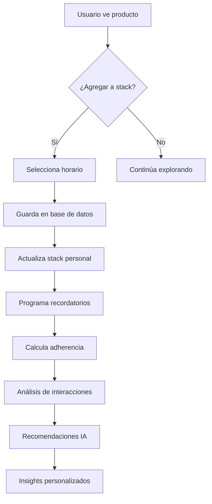
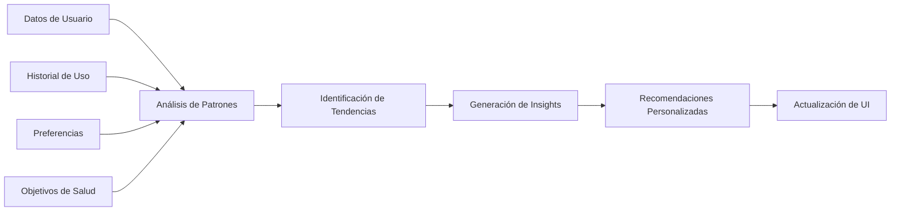
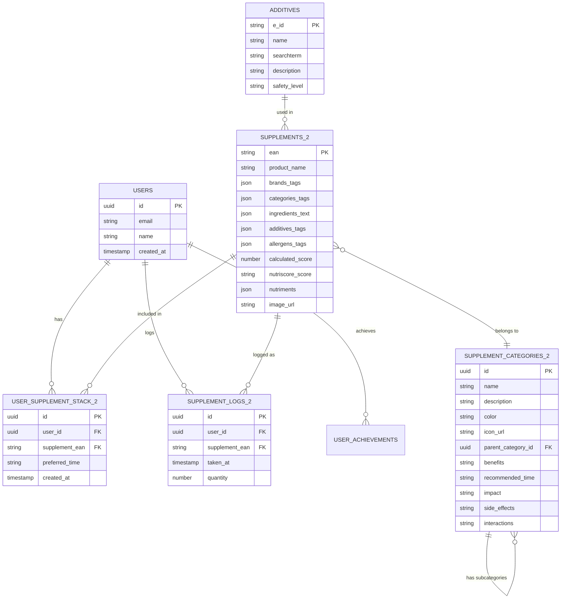
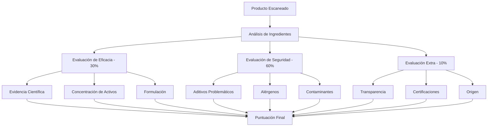

# 🏥 ScanHealth - Tu Asistente Inteligente de Suplementación

<div align="center">
  
  
  [](https://opensource.org/licenses/MIT)
  [](https://www.typescriptlang.org/)
  [](https://reactjs.org/)
  [](https://supabase.com/)
  [](https://vitejs.dev/)
  [](https://github.com/ivanintech/AppScanHealth/actions/workflows/ci.yml)
</div>

> ### 📦 Sobre este repositorio
>
> Copia pública de portfolio del proyecto **ScanHealth**, mantenida por [Ivan InTech](https://github.com/ivanintech) como respaldo del proyecto original y muestra de trabajo.
>
> **Equipo:** Asier Nicolás · Unai Roa · Ivan InTech
>
> - 🔒 **Sin credenciales:** todas las claves se inyectan por variables de entorno ([`.env.example`](./.env.example)). Este repositorio no contiene secretos.
> - 📉 **Sin datasets crudos:** los volcados científicos de gran tamaño (DSLD, NHANES: ~1 GB) no se versionan; se regeneran con los scripts de [`data-science/`](./data-science). Ver [Datos y Datasets](#-datos-y-datasets).

## 📋 Tabla de Contenidos

- [🎯 Descripción General](#-descripción-general)
- [✨ Características Principales](#-características-principales)
- [🏗️ Arquitectura del Sistema](#️-arquitectura-del-sistema)
- [🔄 Flujos de Usuario](#-flujos-de-usuario)
- [🛠️ Stack Tecnológico](#️-stack-tecnológico)
- [📊 Base de Datos](#-base-de-datos)
- [🚀 Instalación y Configuración](#-instalación-y-configuración)
- [📱 Funcionalidades Detalladas](#-funcionalidades-detalladas)
- [🔬 Sistema de Scoring](#-sistema-de-scoring)
- [🤖 Integración con APIs](#-integración-con-apis)
- [🎨 Diseño y UX/UI](#-diseño-y-uxui)
- [📈 Roadmap](#-roadmap)
- [📦 Datos y Datasets](#-datos-y-datasets)
- [🤝 Contribución](#-contribución)
- [📄 Licencia](#-licencia)

## 🎯 Descripción General

**ScanHealth** es una aplicación móvil/web revolucionaria que transforma la forma en que las personas gestionan su suplementación. Utilizando tecnología de escaneo de códigos de barras, inteligencia artificial y análisis científico, ScanHealth proporciona una experiencia completa para descubrir, evaluar y gestionar suplementos nutricionales.

### 🎪 ¿Qué hace ScanHealth?

- **🔍 Escaneo Inteligente**: Escanea códigos de barras de suplementos para obtener información instantánea
- **📊 Evaluación Científica**: Sistema de scoring avanzado basado en evidencia científica
- **📱 Gestión Personal**: Stack personalizado de suplementos con seguimiento de adherencia
- **🧠 IA y Análisis**: Recomendaciones inteligentes basadas en patrones de uso
- **📚 Protocolos Guiados**: Planes de suplementación estructurados por expertos
- **🛒 Integración E-commerce**: Enlaces directos a tiendas confiables para compras

## ✨ Características Principales

### 🔍 **Descubrimiento de Productos**
- Escaneo de códigos de barras con reconocimiento automático
- Base de datos de más de 50,000 suplementos
- Información detallada de ingredientes, alérgenos y beneficios
- Integración con OpenFoodFacts y Examine.com

### 📊 **Sistema de Evaluación Avanzado**
- **Scoring General**: Eficacia (30%), Seguridad (60%), Extra (10%)
- **Nutri-Score**: Evaluación nutricional estandarizada
- **Análisis de Aditivos**: Base de datos de 1,899 aditivos
- **Transparencia**: Evaluación de claridad en etiquetado

### 📱 **Gestión Personal**
- Stack personalizado de suplementos
- Seguimiento de adherencia y progreso en tiempo real
- Recordatorios inteligentes
- Análisis de interacciones entre suplementos
- **NUEVO**: Productos relacionados inteligentes
- **NUEVO**: Sistema de notas personales por producto
- **NUEVO**: Compartir productos con Web Share API

### 🧠 **Inteligencia Artificial**
- Recomendaciones personalizadas
- Análisis de tendencias de bienestar
- Predicción de adherencia
- Insights de salud automatizados

## 🏗️ Arquitectura del Sistema



## 🔄 Flujos de Usuario

### 🔍 **Flujo de Escaneo de Producto**



### 📱 **Flujo de Gestión de Stack**



### 🧠 **Flujo de Análisis con IA**



## 🛠️ Stack Tecnológico

### **Frontend**
- **⚛️ React 18**: Framework principal con hooks modernos
- **📘 TypeScript**: Tipado estático para mayor robustez
- **⚡ Vite**: Build tool ultra-rápido con HMR
- **🎨 Tailwind CSS**: Framework de estilos utility-first
- **🧩 shadcn/ui**: Componentes UI modernos y accesibles
- **🎭 Framer Motion**: Animaciones fluidas y transiciones
- **📱 PWA**: Aplicación web progresiva para móviles

### **Backend & Base de Datos**
- **🗄️ Supabase**: Backend-as-a-Service completo
- **🐘 PostgreSQL**: Base de datos relacional robusta
- **🔐 Row Level Security (RLS)**: Seguridad a nivel de fila
- **⚡ Edge Functions**: Serverless functions para lógica compleja
- **🔄 Real-time**: Sincronización en tiempo real

### **APIs Externas**
- **🌍 OpenFoodFacts**: Base de datos global de productos alimentarios
- **🔬 Examine.com**: Información científica sobre suplementos
- **🛒 E-commerce APIs**: Integración con tiendas online

### **Herramientas de Desarrollo**
- **📦 npm**: Gestor de paquetes
- **🔧 ESLint**: Linting de código
- **💅 Prettier**: Formateo automático
- **🎯 React Query**: Gestión de estado del servidor
- **📊 React Router**: Navegación SPA

## 📊 Base de Datos

### **Esquema Principal**



### **Tablas Principales**

| Tabla | Descripción | Registros |
|-------|-------------|-----------|
| `products` | Catálogo completo de suplementos | ~50,000 |
| `categories` | Categorías y subcategorías | ~50 |
| `additives` | Base de datos de aditivos | 1,899 |
| `user_supplement_stack` | Stack personal de usuarios | Dinámico |
| `supplement_logs` | Historial de toma de suplementos | Dinámico |

**🔄 Actualización v1.1.0**: Migración de tablas `supplements_2` → `products` y `supplement_categories_2` → `categories` para mejor organización y rendimiento.

## 🚀 Instalación y Configuración

### **Prerrequisitos**
- Node.js 18+ 
- npm 9+
- Cuenta de Supabase

### **1. Clonar el Repositorio**
```bash
git clone https://github.com/ivanintech/ScanHealth.git
cd ScanHealth
```

### **2. Instalar Dependencias**
```bash
# Instalar dependencias con legacy peer deps para evitar conflictos
npm install --legacy-peer-deps
```

**Nota**: Se usa `--legacy-peer-deps` para evitar conflictos de dependencias con TypeScript ESLint y otras librerías.

### **3. Configurar Variables de Entorno**
Crear archivo `.env.local`:
```env
VITE_SUPABASE_URL=tu_supabase_url
VITE_SUPABASE_ANON_KEY=tu_supabase_anon_key
```

### **4. Configurar Base de Datos**
```bash
# Ejecutar migraciones de Supabase
npx supabase db reset
npx supabase db push
```

### **5. Iniciar Desarrollo**
```bash
npm run dev
```

La aplicación estará disponible en `http://localhost:8080`

### **6. Comandos Disponibles**
```bash
# Desarrollo
npm run dev              # Servidor de desarrollo en puerto 8080
npm run build            # Construir para producción
npm run preview          # Vista previa de la build de producción

# Calidad de código
npm run lint             # Ejecutar linter
npm run lint:fix         # Corregir errores de linting automáticamente
npm run type-check       # Verificar tipos de TypeScript

# Testing
npm run test             # Ejecutar tests
npm run test:coverage    # Tests con cobertura
npm run test:ui          # Interfaz de testing

# Formateo
npm run format           # Formatear código con Prettier
npm run format:check     # Verificar formato
```

### **7. Dependencias Principales Instaladas**
El proyecto incluye las siguientes dependencias adicionales que se instalan automáticamente:
- `@tailwindcss/typography` - Para tipografía mejorada
- `tailwind-scrollbar-hide` - Para ocultar scrollbars
- `sonner` - Para notificaciones toast
- `@zxing/browser` y `@zxing/library` - Para escaneo de códigos de barras
- `input-otp` - Para campos de código OTP
- `recharts` - Para gráficos y visualizaciones
- `canvas-confetti` - Para efectos de celebración
- `typescript-eslint` - Para linting de TypeScript

### **8. Solución de Problemas Comunes**

#### **Error de dependencias conflictivas**
```bash
# Si encuentras errores de peer dependencies, usa:
npm install --legacy-peer-deps
```

#### **Error de TypeScript ESLint**
```bash
# Si hay problemas con ESLint, verifica que typescript-eslint esté instalado:
npm install typescript-eslint --legacy-peer-deps
```

#### **Error de build con dependencias faltantes**
```bash
# Si faltan dependencias específicas, instálalas manualmente:
npm install @tailwindcss/typography tailwind-scrollbar-hide sonner @zxing/browser @zxing/library input-otp recharts canvas-confetti --legacy-peer-deps
```

#### **Puerto 8080 ocupado**
```bash
# Si el puerto 8080 está ocupado, puedes cambiarlo en vite.config.ts
# O usar otro puerto:
npm run dev -- --port 3000
```

#### **Problemas de linting**
```bash
# Para corregir automáticamente errores de linting:
npm run lint:fix
```

## 📱 Funcionalidades Detalladas

### 🔍 **Sistema de Escaneo**
- **Reconocimiento de Códigos**: Soporte para EAN-13, EAN-8, UPC
- **Búsqueda Offline**: Cache local de productos escaneados
- **Validación Automática**: Verificación de integridad de datos
- **Historial de Escaneos**: Registro de productos consultados

### 📊 **Dashboard Personal**
- **Métricas de Adherencia**: Seguimiento de cumplimiento diario/semanal
- **Score de Bienestar**: Puntuación general basada en hábitos
- **Tendencias Temporales**: Gráficos de evolución a 7D, 30D, ALL
- **Logros y Badges**: Sistema de gamificación

### 🧠 **Inteligencia Artificial**
- **Análisis Predictivo**: Predicción de adherencia basada en patrones
- **Recomendaciones Contextuales**: Sugerencias basadas en objetivos
- **Detección de Interacciones**: Algoritmos para identificar conflictos
- **Insights Automáticos**: Generación de reportes de bienestar

### 📚 **Protocolos Guiados**
- **Categorización Temática**: Fitness, Salud, Rendimiento, etc.
- **Niveles de Dificultad**: Principiante, Intermedio, Avanzado
- **Duración Flexible**: Desde días hasta meses
- **Seguimiento de Progreso**: Métricas de cumplimiento por protocolo

## 🔬 Sistema de Scoring

### **Algoritmo de Evaluación**



### **Criterios de Evaluación**

| Categoría | Peso | Criterios |
|-----------|------|-----------|
| **Eficacia** | 30% | Evidencia científica, concentración, formulación |
| **Seguridad** | 60% | Aditivos, alérgenos, contaminantes |
| **Extra** | 10% | Transparencia, certificaciones, origen |

### **Escala de Puntuación**
- **90-100**: Excelente - Producto de máxima calidad
- **80-89**: Muy Bueno - Producto recomendado
- **70-79**: Bueno - Producto aceptable
- **60-69**: Regular - Producto con limitaciones
- **0-59**: Deficiente - Producto no recomendado

## 🤖 Integración con APIs

### **OpenFoodFacts API**
```typescript
// Ejemplo de integración
const fetchProductData = async (ean: string) => {
  const response = await fetch(`https://world.openfoodfacts.org/api/v0/product/${ean}.json`);
  const data = await response.json();
  return data.product;
};
```

### **Examine.com (Simulado)**
```typescript
// Sistema de datos científicos simulados
const generateScientificData = (productName: string) => {
  // Lógica inteligente basada en el nombre del producto
  // Genera datos realistas de beneficios, dosis, efectos secundarios
};
```

### **E-commerce Integration**
- **Amazon**: Enlaces directos a productos
- **iHerb**: Integración con API de precios
- **MyProtein**: Comparación de precios
- **Google Shopping**: Búsqueda de ofertas

## 🎨 Diseño y UX/UI

### **Principios de Diseño**
- **🎯 User-Centered**: Diseño centrado en la experiencia del usuario
- **♿ Accesibilidad**: Cumplimiento de estándares WCAG 2.1
- **📱 Mobile-First**: Optimizado para dispositivos móviles
- **🎨 Consistencia**: Sistema de diseño unificado

### **Componentes UI**
- **Cards**: Tarjetas de productos y categorías
- **Badges**: Indicadores de puntuación y características
- **Charts**: Gráficos de progreso y tendencias
- **Modals**: Ventanas emergentes para detalles
- **Navigation**: Navegación intuitiva con tabs

### **Paleta de Colores**
```css
:root {
  --primary: #3B82F6;      /* Azul principal */
  --secondary: #10B981;    /* Verde éxito */
  --accent: #F59E0B;       /* Amarillo advertencia */
  --danger: #EF4444;       /* Rojo error */
  --success: #22C55E;      /* Verde éxito */
  --warning: #F97316;      /* Naranja advertencia */
}
```

## 🆕 Últimas Actualizaciones - Versión 1.1.0

### **✨ Nuevas Funcionalidades Implementadas**

#### **🎯 Productos Relacionados Inteligentes**
- **Búsqueda Avanzada**: Algoritmo inteligente que encuentra productos similares por categorías y nombres
- **Scroll Horizontal**: Navegación fluida con estilos personalizados
- **Tarjetas Consistentes**: Mismo formato que "Mi Stack" con información completa
- **Navegación Directa**: Click para ir al detalle del producto relacionado

#### **📱 Funcionalidades de Compartir y Notas**
- **Compartir Inteligente**: Web Share API nativa con fallback a copiar enlace
- **Notas Personales**: Sistema de notas por producto con persistencia local
- **Modales Profesionales**: Interfaz limpia para gestión de notas
- **Toast Notifications**: Feedback visual para todas las acciones

#### **🔍 Mejoras en Exploración**
- **Búsqueda Unificada**: Busca en categorías principales y subcategorías
- **Iconos Dinámicos**: Asignación automática de iconos por categoría
- **Navegación Mejorada**: Botón "atrás" en protocolos lleva a "Explorar"
- **Categorías Enriquecidas**: Información adicional (modo de uso, audiencia objetivo, consideraciones)

#### **📊 Dashboard y Progreso Optimizado**
- **KPIs en Tiempo Real**: Actualización instantánea de métricas
- **Cálculo de Adherencia**: Algoritmo mejorado para conteo de suplementos únicos
- **Rachas y Logros**: Paneles más compactos y funcionales
- **Datos Históricos**: Lógica corregida para fechas y semanas

#### **🛠️ Mejoras Técnicas**
- **Base de Datos Actualizada**: Migración de `supplements_2` a `products` y `categories`
- **Cache Inteligente**: Invalidación y refetch optimizados con React Query
- **Componentes Reutilizables**: Sistema de loading profesional unificado
- **Validación Robusta**: Verificación de EANs antes de inserción
- **Error Handling**: Manejo elegante de errores con fallbacks

#### **🎨 Mejoras de UX/UI**
- **Loading States**: Pantallas de carga profesionales y consistentes
- **Animaciones Suaves**: Transiciones mejoradas con framer-motion
- **Scroll Personalizado**: Estilos de scrollbar elegantes
- **Responsive Design**: Optimización para móviles y desktop
- **Toast System**: Notificaciones automáticas con auto-dismiss

### **🔧 Correcciones Importantes**
- ✅ **Navegación de Protocolos**: Botón "atrás" corregido
- ✅ **KPIs de Progreso**: Cálculo de adherencia semanal arreglado
- ✅ **Productos Relacionados**: Búsqueda más precisa y relevante
- ✅ **Cache de Datos**: Sincronización en tiempo real mejorada
- ✅ **Validación de EANs**: Prevención de errores de foreign key
- ✅ **Toast Dismissal**: Auto-dismiss de notificaciones corregido

## 📈 Roadmap

### **🚀 Versión 2.0 (Q2 2025)**
- [ ] **IA Avanzada**: Machine Learning para recomendaciones
- [ ] **Análisis Nutricional**: Integración con wearables
- [ ] **Comunidad**: Sistema de reviews y ratings
- [ ] **Multi-idioma**: Soporte para 5 idiomas

### **🌟 Versión 3.0 (Q4 2025)**
- [ ] **Realidad Aumentada**: Visualización 3D de ingredientes
- [ ] **Blockchain**: Trazabilidad de ingredientes
- [ ] **Telemedicina**: Consultas con nutricionistas
- [ ] **IoT Integration**: Smart dispensers

### **🔮 Futuro**
- [ ] **Genómica**: Recomendaciones basadas en ADN
- [ ] **Microbioma**: Análisis de microbiota intestinal
- [ ] **Metabolómica**: Análisis de metabolitos
- [ ] **Farmacogenómica**: Interacciones genéticas

## 📦 Datos y Datasets

La aplicación se alimenta de fuentes científicas públicas. Los volcados completos (**~1 GB en total**) **no se versionan** en este repositorio: son redundantes (se descargan de las fuentes oficiales) y exceden con creces lo razonable para un repositorio de código.

| Dataset | Fuente oficial | Tamaño aprox. | Ruta esperada |
|---|---|---|---|
| **DSLD** — Dietary Supplement Label Database | [dsld.od.nih.gov](https://dsld.od.nih.gov/) (NIH) | ~774 MB | `public/data/dsld/` |
| **NHANES** — National Health and Nutrition Examination Survey | [wwwn.cdc.gov/nchs/nhanes](https://wwwn.cdc.gov/nchs/nhanes/) (CDC) | ~296 MB | `public/data/nhanes/` |

### Regenerar los datos

La extracción y normalización vive en [`data-science/`](./data-science):

```bash
# 1. Rellena tus claves en .env (parte de .env.example)
cp .env.example .env

# 2. Explora los scripts de extracción y el pipeline de ingredientes
ls data-science/            # Scrappers, ExtractAdditives y salidas en Excel/JSON
```

Los JSON ya procesados y de menor tamaño (`additives.json`, `protocols.json`, `off.products.json`, `kaggle_fitness/`) **sí se incluyen**, de modo que la aplicación arranca, navega y evalúa suplementos sin descargar los volcados crudos.

> Una vez descargues los datasets, `.gitignore` ya los excluye: se quedan en local y no engordan el repositorio.

## 🤝 Contribución

### **Cómo Contribuir**
1. **Fork** el repositorio
2. **Crea** una rama para tu feature (`git checkout -b feature/AmazingFeature`)
3. **Commit** tus cambios (`git commit -m 'Add some AmazingFeature'`)
4. **Push** a la rama (`git push origin feature/AmazingFeature`)
5. **Abre** un Pull Request

### **Estándares de Código**
- **TypeScript**: Tipado estricto requerido
- **ESLint**: Configuración estándar
- **Prettier**: Formateo automático
- **Tests**: Cobertura mínima del 80%

### **Áreas de Contribución**
- 🐛 **Bug Fixes**: Corrección de errores
- ✨ **Features**: Nuevas funcionalidades
- 📚 **Documentación**: Mejora de docs
- 🎨 **UI/UX**: Mejoras de diseño
- 🔬 **Algoritmos**: Optimización de scoring

## 📄 Licencia

Este proyecto está licenciado bajo la Licencia MIT - ver el archivo [LICENSE](LICENSE) para detalles.

## 📞 Contacto

Proyecto desarrollado en equipo:

- **Asier Nicolás** — *El Mesías*
- **Unai Roa** — *Desarrollador*
- **Ivan InTech** — *Desarrollador* · [github.com/ivanintech](https://github.com/ivanintech)

---

<div align="center">
  <p>Hecho con ❤️ para mejorar la salud y bienestar de las personas</p>
  <p>⭐ ¡Dale una estrella si te gusta el proyecto!</p>
</div>